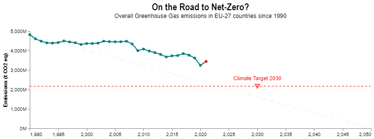
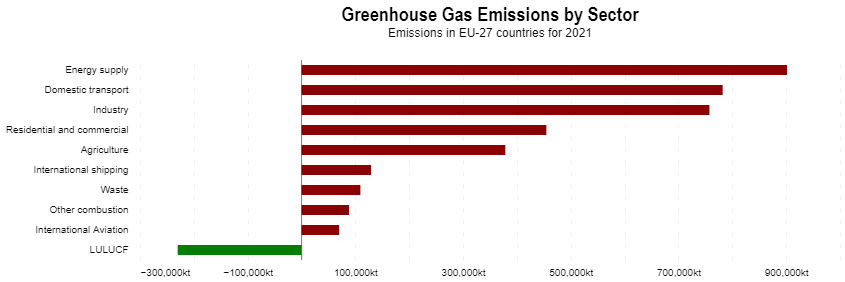
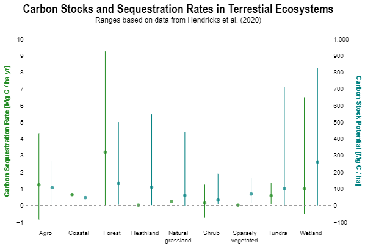
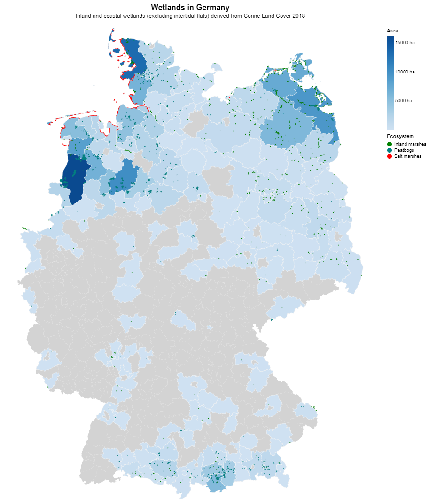
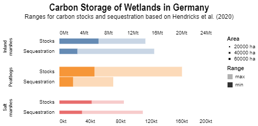
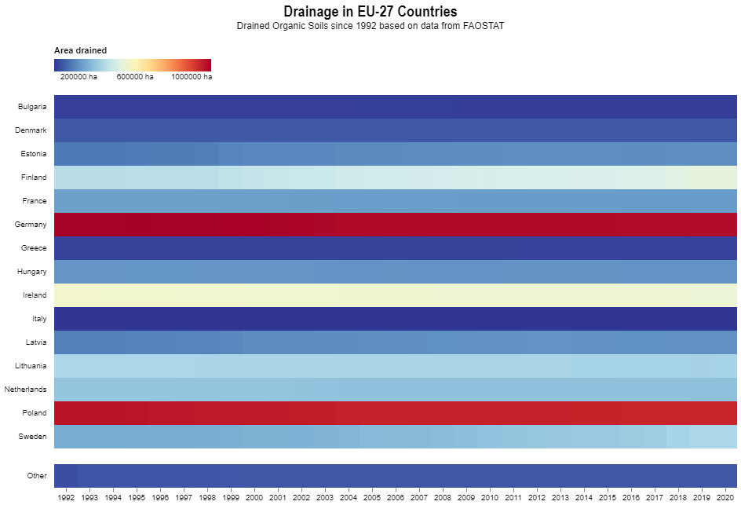

# The Potential of Wetlands to Migitate Climate Change

Climate change is one of the greatest global challenges of our time. Therefore, the EU targets to achieve climate neutrality until 2050, including the intermediate target of an at least 55% net reduction in greenhouse gas emissions by 2030. This is "in line with the Paris Agreement objective to limit the rise in global temperature to well below 2°C and pursue efforts to keep it to 1.5°C" ([2030 Climate Target Plan](https://climate.ec.europa.eu/eu-action/european-green-deal/2030-climate-target-plan_en)), avoiding the most severe consequences of climate change. 

However, how far did we get since 1990? Are we on track to reach our climate targets for 2030 and 2050?

Although reduction efforts have overall increased in recent years, it is visible that there is still much work to be done. To achieve the climate target of 2030 we still have to reduce our emissions by over 1000M CO2-eq. Assuming an linear trend towards net neutrality, we are below the results we should achieve.

Main drivers of GHG emissions are the **energy supply**, **domestic transport** and **industry** sectors. If we want to reduce our emissions, we need to find and implement new solutions for the different sectors. Well-known examples are the expansion of renewable "green" energies or advances in public and private mobility concepts. 

Next to the other sectors, the Land Use, Land-Use Change and Forestry (LULUCF) sector plays a special role as it is the only sector that **is taking up more carbon from the atmosphere than it releases**, effectively serving as a carbon sink. It covers emissions and removals of greenhouse gases resulting from direct human-induced land use such as settlements and commercial uses, land-use change, and forestry activities. Especially land use is also of critical importance for biodiversity.

What becomes visible here is a **large potential in the natural environment and healthy ecosystems** to combat climate change - next to a variety of many other positive, ecological effects for the planet. From an anthropocentric perspective: How can our ecosystems serve as carbon sinks and what could we do to utilize this effect? 

When talking about carbon sinks, there are two main variables to take into account: the capacity of storing carbon in **carbon stocks** or carbon pools, and the rate at which atmospheric carbon dioxide is captured and stored in a process called **carbon sequestration**.  

Taking a look into academic research, we can see the potential of different ecosystems regarding carbon stocks and carbon sequestration rates. The ranges shown here are based on a literature comparison of [Hendricks et al.](https://www.eea.europa.eu/publications/carbon-stocks-and-sequestration-rates/carbon-stocks-and-sequestration-in/carbon-stocks/download) from 2020 in which different studies for a variety of ecosystems were inspected. Naturally, the systems investigated are complex and highly dependent on a multitude of environmental factors like the biogeographical zone they are located in, or properties and composition of soils. So, determining those variables in detail is a difficult task which requires a lot of data and understanding of the ecosystem investigated.

Although research in this field is confronted with many uncertainties, a few trends become clear: Next to forests (which have an excellent sequestration rate), **wetlands have one of the highest carbon sink potentials**. This recognition increasingly gets into public focus and measures are being taken to benefit from this potential.

Germany encompasses inland wetlands as well as coastal wetlands, with the most potential in the northern parts of Germany, close to the coast, and far southern parts. There are high potential salt marshes, distributed marshes and peatbogs. "Wet" forest ecosystems like swamp forests which are often classified as part of wetlands could not be distinguished from other forest ecosystems in the CORINE Land Cover dataset and are therefore not included. But it becomes clear that there are also wetland based carbon sinks in Germany.

The wetland types classified for Germany differ in their distribution and potential. Peatbogs take the largest part with the largest carbon stocks, but lowest sequestration rates. They especially serve as long-time carbon sinks. Salt marshes cover the smallest area but are highly efficient, still reaching values close to the shown inland marshes. Overall, there is a lot of uncertainty in the calculation, but **despite their small coverage, wetlands contribute a significant part in storing carbon** and should be taken into consideration for reaching climate neutrality. Wetland conservation and restoration should become a priority.

For reference: 

"If kept in a good condition or restored, the EU wetland related carbon stock capacity of their overall area in Europe (EU 27 and the UK) is estimated to be between 12 - 31 Gt CO2-eq, corresponding to an overall value ranging between 3 and 8 years of EU GHG emissions. Whereas the Carbon sequestration potential of healthy EU Wetlands per year is calculated to range between 24 and 144 Mt CO2 eq yr-1 (24,352 and 14,3719 kt CO2 eq yr-1), being a quantity that contributes to “neutralising” between 1 and 4 % of the total GHG emissions registered in the EU27 and the UK (according to 2018 reference year for reported emission)." (ETC/ULS Report | 10/2021)

Not all original wetlands act as carbon sinks. Drainage causes **significant release of CO2 in the atmosphere** which is conducted for agriculture, among other land uses. For example, the organic soils are drained for grasslands and croplands. One reason for this is the land use competition, as unmanaged wetlands cannot be utilized economically by land owners.

Data from FAOSTAT estimates the area of drained organic soils in the EU-27 countries, based on geospatial analysis. The heatmap shows two major points:
1. **Germany is one of the leaders regarding drainage of organic soils**
2. The area drained did not decrease over the years but either remained more or less constant, or - in the cases of Sweden and Finland - started to increase.

In fact, the majority of peatlands in Germany have been drained and thus contribute strongly to greenhouse gas emissions. The restoration and rewetting of those lands can transform those carbon net sources to carbon net sinks. Making this a priority can be a crucial step on our path to combat climate change.